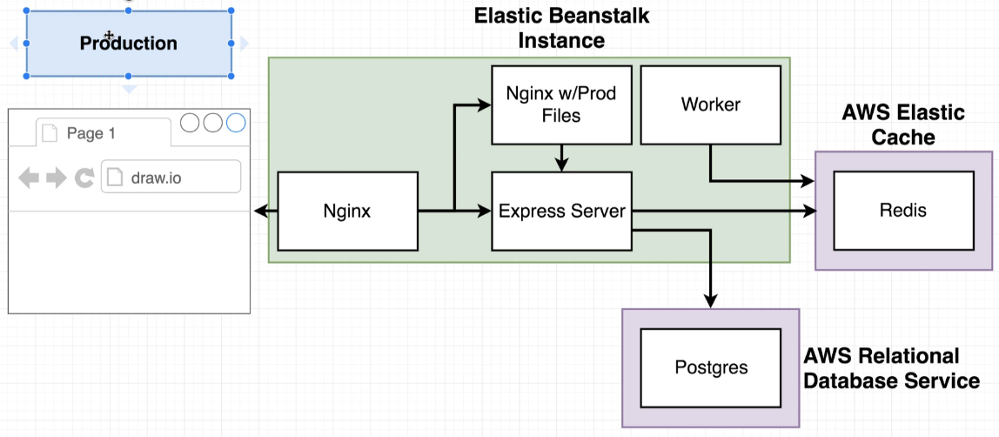
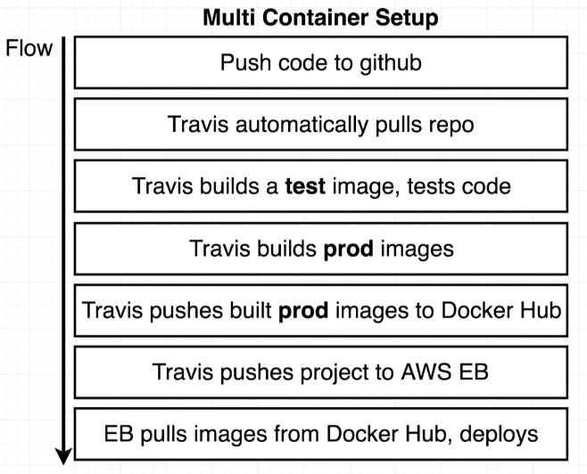

# Dockerize fullstack-app

This repo was created based in a course on Udemy called <a href="https://www.udemy.com/course/docker-and-kubernetes-the-complete-guide/">Docker and Kubernetes: The Complete Guide</a>

## App structure

Deployment app architecture

Development app architecture explanation

Workflow to deployment

## Running the project

    docker-compose up --build

PS: use --build if you want to build the project before running it.
